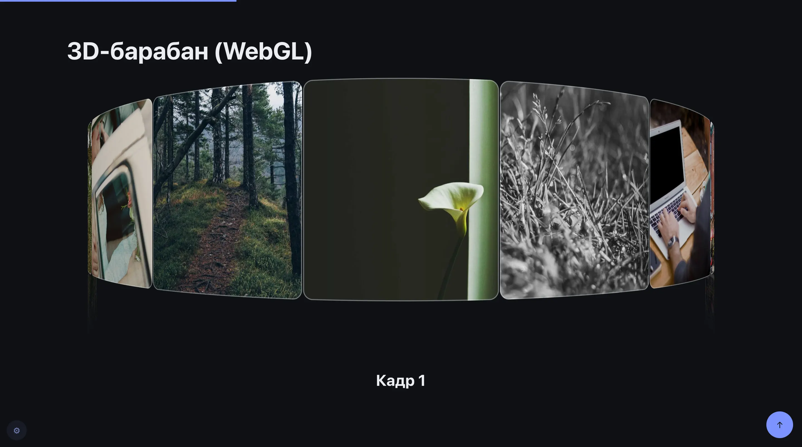
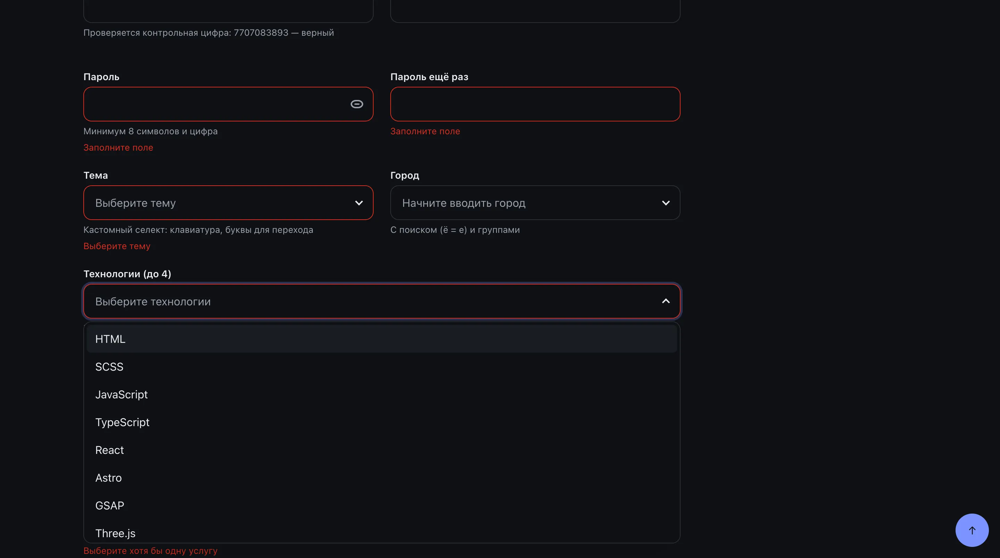

<div align="center">

<a href="https://dmitriy9427.github.io/frontend-kit/"></a>

# 🧰 frontend-kit

**Личный шаблон для старта проектов: HTML-компоненты, модули, формы, SCSS, i18n, dev-панель — vanilla / React / Astro**

### [Открыть демо (vanilla-стартер) →](https://dmitriy9427.github.io/frontend-kit/)

      [](https://github.com/dmitriy9427/frontend-kit/actions/workflows/pages.yml)

</div>

| Формы                                                  |
| ------------------------------------------------------ |
|  |

## Коротко

|     |                                                                                                                                                              |
| :-: | ------------------------------------------------------------------------------------------------------------------------------------------------------------ |
| 🧱  | **HTML-компоненты** — папка = `card.html` + `card.scss` + `card.js` → `<x-card>`; props, слоты, `x-for`/`x-if`, данные из JSON; стили и JS подключаются сами |
| 🧩  | **39 модулей** — модалки, табы, слайдеры, 3D-барабан, Flip-фильтр, курсор… — `data-module`, связь через `ctx.modules` и шину                                 |
| 🎨  | **SVG-спрайт** — `src/icons/*.svg` → `<x-icon name>`, в страницу только нужные иконки                                                                        |
| 🪄  | **Генератор** — `npm run new -- component card --js`, `module`, `plugin`, `page`                                                                             |
| 📝  | **Формы** — схемы в стиле zod, 9 масок, ошибки с сервера под полями                                                                                          |
| 🌐  | **i18n** — склонения, ru/en, hreflang и sitemap в Astro                                                                                                      |
|  🛠  | **Dev-панель** — сетка, макет поверх вёрстки, FPS, проверка доступности — в прод не попадает                                                                 |
| ⚡  | **4 стартера** — vanilla, React, React + TS, Astro — `npm run create`                                                                                        |
| ✅  | **Качество** — 258 тестов, ESLint, Stylelint, проверка JSDoc-типов                                                                                           |

Автор — [Дмитрий Рябов](https://dmitriy9427.github.io/resume/), frontend-разработчик.

---

```bash
npm install
npm run create -- ../my-site --stack astro    # vanilla | react | react-ts | astro
```

## Что внутри

|                  |                                                                                                                                                                                                                                       |
| ---------------- | ------------------------------------------------------------------------------------------------------------------------------------------------------------------------------------------------------------------------------------- |
| **39 модулей**   | аккордеон, табы (в адресе), модалка (по ссылке #id), меню, слайдер, Swiper с пресетами, бесконечная лента и 3D-барабан, бесконечная галерея, лайтбокс, горизонтальный скролл, Flip-фильтр, стопка карточек, курсор, кастомный селект… |
| **Формы**        | схемы проверки в стиле zod, режимы как в react-hook-form, 9 масок (телефон, дата, ИНН с контрольной суммой…), загрузка файлов, пароль, счётчик символов, ошибки с сервера под полями                                                  |
| **SCSS**         | настройки проекта в одном файле, плавная типографика, брейкпоинты общие с JS, тёмная тема, БЭМ                                                                                                                                        |
| **Стеки**        | vanilla (вёрстка), React, React + TypeScript, Astro (мультиязычный сайт, SEO)                                                                                                                                                         |
| **Языки**        | переводы со склонениями, все тексты кита на ru/en, hreflang и sitemap в Astro                                                                                                                                                         |
| **TypeScript**   | проверка JSDoc во всём ките, строгий TS в react-ts и astro                                                                                                                                                                            |
| **Dev-панель**   | сетка, макет поверх вёрстки, FPS, поиск переполнения, проверка доступности — **в прод не попадает** (проверяется при сборке)                                                                                                          |
| **Vite-плагины** | `<include>` для HTML, автосбор страниц, мок-API, защита прода                                                                                                                                                                         |
| **Качество**     | ESLint, Stylelint, Prettier, 150+ тестов, `npm run check` перед сдачей                                                                                                                                                                |
| **Документация** | [docs/](docs/README.md), README в каждой папке, комментарий в каждом файле, [разбор частых багов](docs/troubleshooting.md)                                                                                                            |

## Команды шаблона

| Команда                                                 | Что делает                                     |
| ------------------------------------------------------- | ---------------------------------------------- |
| `npm run create`                                        | создать проект (спросит папку и стек)          |
| `npm run create -- --update ../my-site`                 | обновить kit/ в проекте                        |
| `npm run dev`, `dev:react`, `dev:react-ts`, `dev:astro` | стартеры прямо в шаблоне — для разработки кита |
| `npm test`, `npm run lint`, `npm run check`             | тесты, линтеры, всё вместе + сборка            |

## Документация

Начните с [docs/getting-started.md](docs/getting-started.md). Что-то сломалось —
[docs/troubleshooting.md](docs/troubleshooting.md).
